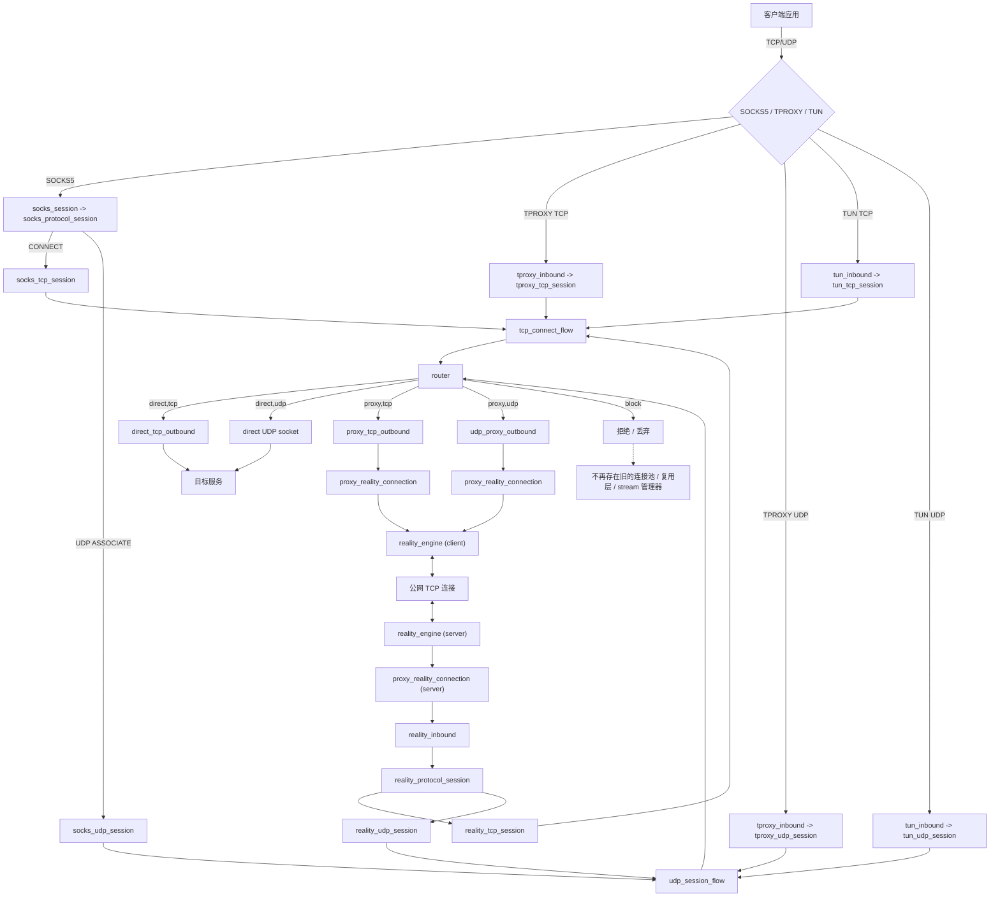
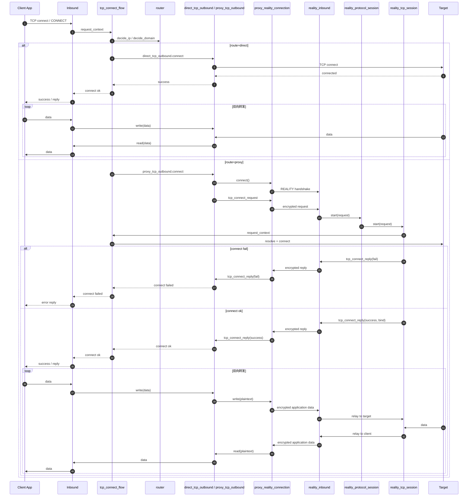
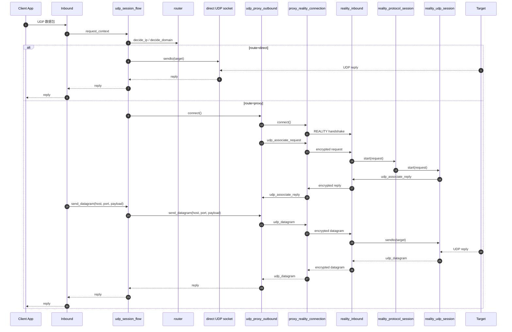
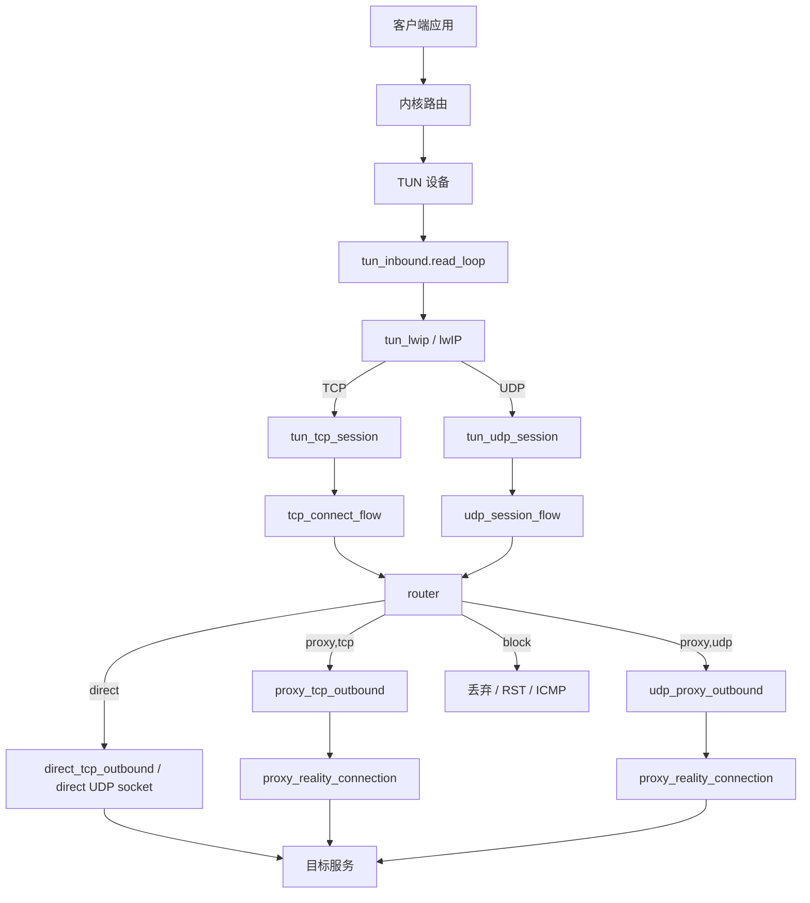

# 代理系统当前流程图

## 1. 核心约束

- `route=proxy` 时不再复用隧道。
- 一个 TCP 代理请求对应一条 `proxy_reality_connection`。
- 一个 UDP 代理会话对应一条 `udp_proxy_outbound -> proxy_reality_connection`。
- 服务端通过 `reality_inbound` 完成 REALITY 认证后，只处理一个代理会话。
- UDP 仍保留 `udp_datagram` framing，用来保存报文边界；它只负责报文边界，不承担连接复用。
- 域名解析统一使用系统 dns，不引入自定义 dns 组件。

## 2. 总体架构与数据流

当前 TCP/UDP 主路径已经收敛到四个公共模块：
- `tcp_connect_flow`：统一处理目标识别、路由决策、出站实例创建。
- `udp_session_flow`：统一处理 UDP 路由决策、模式选择、代理出站建立。
- `stream_relay`：统一处理 `socket <-> tcp_outbound_stream` 的双向转发与 idle watchdog。
- `datagram_relay`：统一处理 UDP 回包循环、代理回包循环与 idle watchdog。



## 3. TCP 正常流程



## 4. UDP 正常流程



## 5. 生命周期与异常路径

```mermaid
flowchart TD
  Start[收到代理请求] --> Route{路由结果}

  Route -->|block| Reject[拒绝 / 丢弃]
  Route -->|direct| Direct[直接建立 TCP/UDP 出口]
  Route -->|proxy| NewConn[新建 proxy_reality_connection]

  NewConn -->|握手失败| HandshakeFail[返回错误并关闭]
  NewConn -->|TCP| TcpReq[tcp_connect_request]
  NewConn -->|UDP| UdpReq[udp_associate_request]

  TcpReq -->|connect fail| TcpFail[tcp_connect_reply(fail)]
  TcpReq -->|connect ok| TcpRelay[TCP 双向转发]

  UdpReq -->|associate fail| UdpFail[udp_associate_reply(fail)]
  UdpReq -->|associate ok| UdpRelay[udp_datagram 往返转发]

  TcpRelay -->|EOF| HalfClose[shutdown_send 另一侧]
  TcpRelay -->|read/write error| CloseConn[关闭整条 REALITY 连接]
  TcpRelay -->|idle timeout| CloseConn

  UdpRelay -->|idle timeout| CloseConn
  UdpRelay -->|非法报文 / payload 过大| DropOrClose[丢弃或关闭]

  note1["没有复用会话标识、旧式控制帧、预建隧道恢复逻辑"]
  CloseConn -.-> note1
```

## 6. TUN 路径



## 7. 与旧架构的区别

- 客户端不再预建长期 REALITY 隧道。
- 服务端不再在一条连接上承载多个并发子会话。
- TCP 关闭语义回到“连接即会话”，半关闭直接依赖 `shutdown_send`。
- UDP 仍然有内部报文封装，但只保留 `udp_associate_reply` 和 `udp_datagram` 这类单会话协议消息。

## 8. 当前运行时清理基线

- 已删除旧的预建隧道、连接复用和控制帧实现。
- 已删除旧的 `connection_tracker` 和只增减不读取的连接守卫。
- `route=proxy` 时，TCP 请求和 UDP 会话都直接新建 `proxy_reality_connection`，不再存在预建隧道槽位。
- `socks_session` 已拆出 `socks_protocol_session`，`reality_inbound` 已拆出 `reality_protocol_session`。
- `socks_tcp_session`、`reality_tcp_session`、`tproxy_tcp_session`、`tun_tcp_session` 已接入统一 `tcp_connect_flow`。
- `socks_udp_session`、`reality_udp_session`、`tproxy_udp_session`、`tun_udp_session` 已接入统一 `udp_session_flow`。
- `socks_tcp_session`、`reality_tcp_session`、`tproxy_tcp_session` 已接入统一 `stream_relay`。
- 四条 UDP 会话路径都已经复用 `datagram_relay` 的公共收包、回包与 idle watchdog 编排能力。
- 连接关闭和正常收尾错误判断统一收敛到 `net_utils`：
  `is_basic_close_error`、`is_socket_close_error`、`is_socket_shutdown_error`、`is_channel_close_error`。
- 日志统一使用 `log_event::kRelay`，语义与当前架构一致。

## 9. 严格告警验证

- 构建系统新增了 `ENABLE_STRICT_WARNINGS` 开关，默认关闭，不影响日常构建。
- 当前严格告警集包含：
  `-Wshadow`、`-Wpedantic`、`-Wcast-qual`、`-Wold-style-cast`、`-Wsign-conversion`
- 推荐用单独构建目录验证：

```bash
cmake -S . -B build-gcc-strict \
  -DCMAKE_C_COMPILER=gcc \
  -DCMAKE_CXX_COMPILER=g++ \
  -DENABLE_ASAN=OFF \
  -DENABLE_TSAN=OFF \
  -DENABLE_LSAN=OFF \
  -DENABLE_STRICT_WARNINGS=ON \
  -DOPENSSL_ROOT_DIR=/home/gyl/openssl \
  -DBOOST_ROOT=/home/gyl/boost_1_89_0
cmake --build build-gcc-strict -j8
```

```bash
cmake -S . -B build-clang-strict \
  -DCMAKE_C_COMPILER=clang \
  -DCMAKE_CXX_COMPILER=clang++ \
  -DENABLE_ASAN=OFF \
  -DENABLE_TSAN=OFF \
  -DENABLE_LSAN=OFF \
  -DENABLE_STRICT_WARNINGS=ON \
  -DOPENSSL_ROOT_DIR=/home/gyl/openssl \
  -DBOOST_ROOT=/home/gyl/boost_1_89_0
cmake --build build-clang-strict -j8
```

- 当前代码在 GCC 和 Clang 下都已通过这组 stricter warnings 的全量编译。
