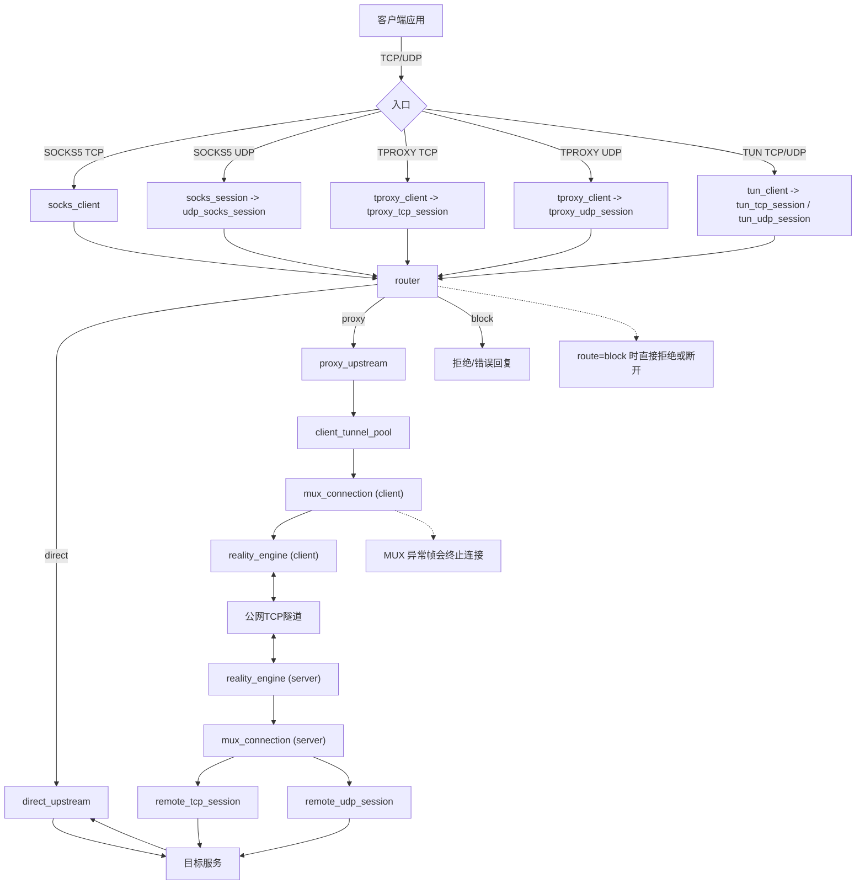
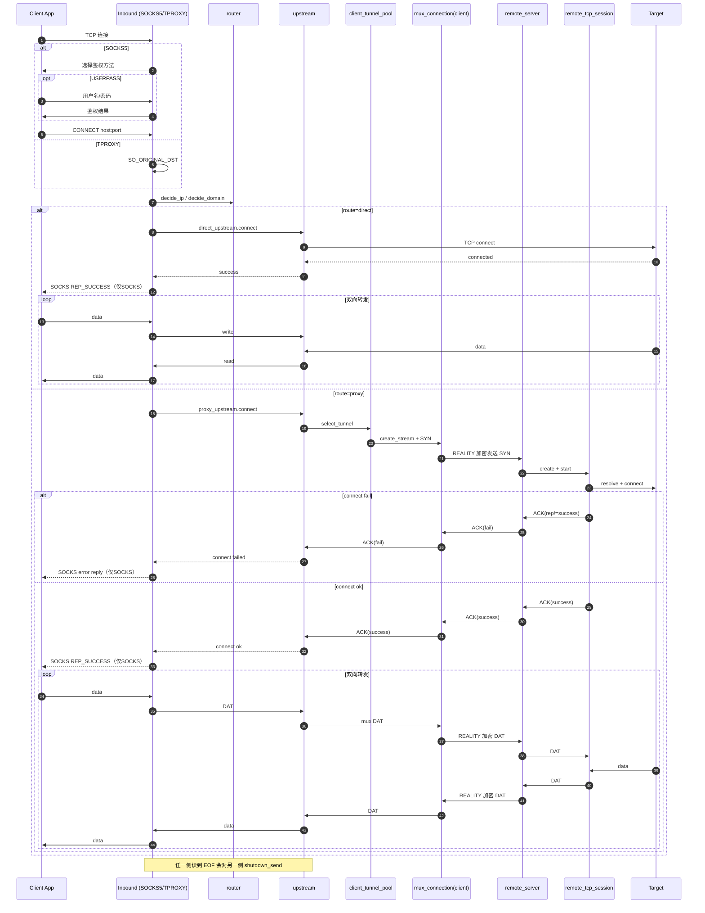
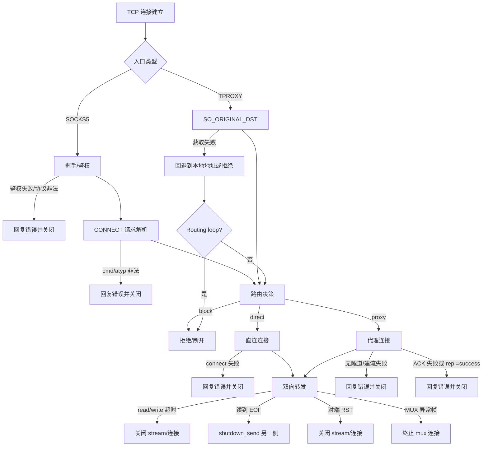
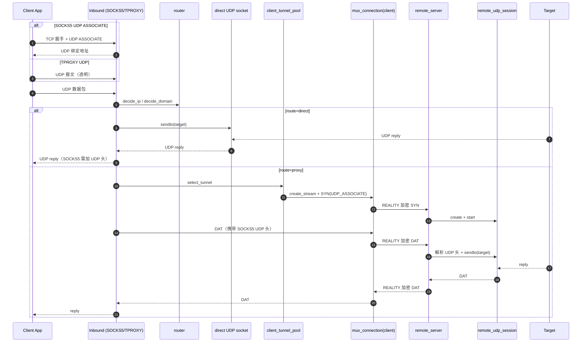
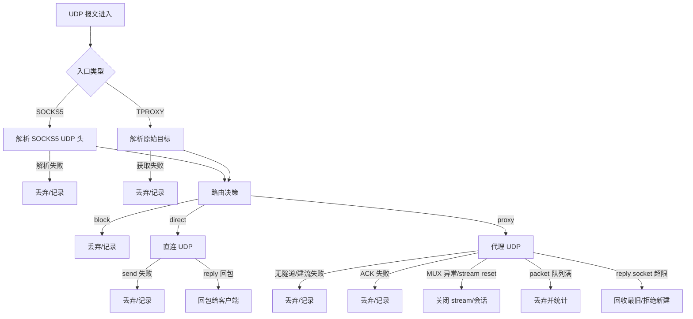
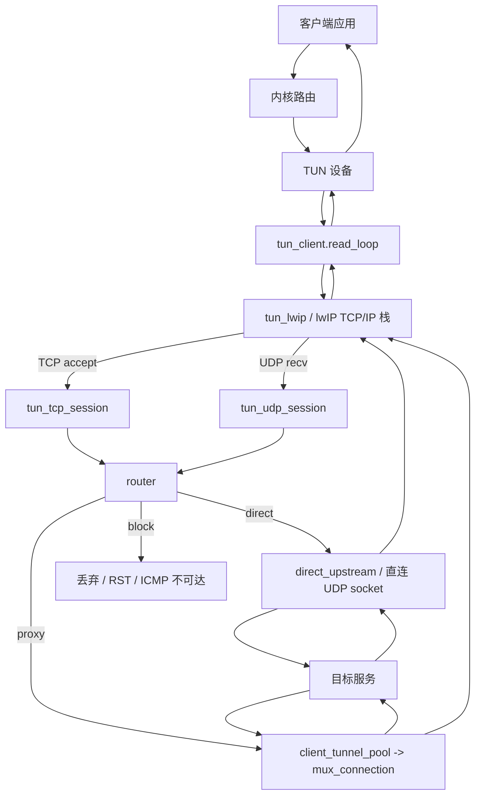

# 代理系统详细流程图

## 1. 总体架构与数据流

```mermaid
flowchart TD
  App[客户端应用] -->|TCP/UDP| Inbound{入口}

  Inbound -->|SOCKS5 TCP| SocksListener[socks_client]
  Inbound -->|SOCKS5 UDP| SocksUdpAssoc["socks_session -> udp_socks_session"]
  Inbound -->|TPROXY TCP| TproxyTcpListener["tproxy_client -> tproxy_tcp_session"]
  Inbound -->|TPROXY UDP| TproxyUdpListener["tproxy_client -> tproxy_udp_session"]
  Inbound -->|TUN TCP/UDP| TunInbound["tun_client -> tun_tcp_session / tun_udp_session"]

  SocksListener --> Router[router]
  SocksUdpAssoc --> Router
  TproxyTcpListener --> Router
  TproxyUdpListener --> Router
  TunInbound --> Router

  Router -->|direct| DirectUp[direct_upstream]
  Router -->|proxy| ProxyUp[proxy_upstream]
  Router -->|block| Block[拒绝/错误回复]

  DirectUp --> Target[目标服务]
  Target --> DirectUp

  ProxyUp --> TunnelPool[client_tunnel_pool]
  TunnelPool --> MuxClient["mux_connection (client)"]
  MuxClient --> RealityClient["reality_engine (client)"]
  RealityClient <--> Network[公网TCP隧道]
  Network <--> RealityServer["reality_engine (server)"]
  RealityServer --> MuxServer["mux_connection (server)"]
  MuxServer --> RemoteTcp[remote_tcp_session]
  MuxServer --> RemoteUdp[remote_udp_session]
  RemoteTcp --> Target
  RemoteUdp --> Target

  RouterNote["route=block 时直接拒绝或断开"]
  Router -.-> RouterNote
  MuxNote["MUX 异常帧会终止连接"]
  MuxClient -.-> MuxNote
```

## 2. TCP 正常流程（SOCKS5 / TPROXY）

```mermaid
sequenceDiagram
  autonumber
  participant App as Client App
  participant Inb as Inbound (SOCKS5/TPROXY)
  participant Router as router
  participant Up as upstream
  participant Pool as client_tunnel_pool
  participant MuxC as mux_connection(client)
  participant RServer as remote_server
  participant RTcp as remote_tcp_session
  participant Target as Target

  App->>Inb: TCP 连接
  alt SOCKS5
    Inb->>App: 选择鉴权方法
    opt USERPASS
      App->>Inb: 用户名/密码
      Inb->>App: 鉴权结果
    end
    App->>Inb: CONNECT host:port
  else TPROXY
    Inb->>Inb: SO_ORIGINAL_DST
  end

  Inb->>Router: decide_ip / decide_domain
  alt route=direct
    Inb->>Up: direct_upstream.connect
    Up->>Target: TCP connect
    Target-->>Up: connected
    Up-->>Inb: success
    Inb-->>App: SOCKS REP_SUCCESS（仅SOCKS）
    loop 双向转发
      App->>Inb: data
      Inb->>Up: write
      Target->>Up: data
      Up->>Inb: read
      Inb->>App: data
    end
  else route=proxy
    Inb->>Up: proxy_upstream.connect
    Up->>Pool: select_tunnel
    Pool->>MuxC: create_stream + SYN
    MuxC->>RServer: REALITY 加密发送 SYN
    RServer->>RTcp: create + start
    RTcp->>Target: resolve + connect
    alt connect fail
      RTcp->>RServer: ACK(rep!=success)
      RServer->>MuxC: ACK(fail)
      MuxC->>Up: ACK(fail)
      Up-->>Inb: connect failed
      Inb-->>App: SOCKS error reply（仅SOCKS）
    else connect ok
      RTcp->>RServer: ACK(success)
      RServer->>MuxC: ACK(success)
      MuxC->>Up: ACK(success)
      Up-->>Inb: connect ok
      Inb-->>App: SOCKS REP_SUCCESS（仅SOCKS）
      loop 双向转发
        App->>Inb: data
        Inb->>Up: DAT
        Up->>MuxC: mux DAT
        MuxC->>RServer: REALITY 加密 DAT
        RServer->>RTcp: DAT
        Target->>RTcp: data
        RTcp->>RServer: DAT
        RServer->>MuxC: REALITY 加密 DAT
        MuxC->>Up: DAT
        Up->>Inb: data
        Inb->>App: data
      end
    end
  end

  Note over Inb,Up: 任一侧读到 EOF 会对另一侧 shutdown_send
```

## 3. TCP 异常与边界流程

```mermaid
flowchart TD
  Start[TCP 连接建立] --> Entry{入口类型}
  Entry -->|SOCKS5| HS[握手/鉴权]
  Entry -->|TPROXY| ODst[SO_ORIGINAL_DST]

  HS -->|鉴权失败/协议非法| HSFail[回复错误并关闭]
  HS --> Req[CONNECT 请求解析]
  Req -->|cmd/atyp 非法| ReqFail[回复错误并关闭]

  ODst -->|获取失败| Fallback[回退到本地地址或拒绝]
  Fallback --> LoopGuard{Routing loop?}

  Req --> Router[路由决策]
  ODst --> Router

  Router -->|block| Block[拒绝/断开]
  Router -->|direct| DirectConn[直连连接]
  Router -->|proxy| ProxyConn[代理连接]

  DirectConn -->|connect 失败| DirectFail[回复错误并关闭]
  DirectConn --> Relay[双向转发]

  ProxyConn -->|无隧道/建流失败| ProxyFail[回复错误并关闭]
  ProxyConn -->|ACK 失败或 rep!=success| AckFail[回复错误并关闭]
  ProxyConn --> Relay

  Relay -->|read/write 超时| Timeout[关闭 stream/连接]
  Relay -->|读到 EOF| HalfClose[shutdown_send 另一侧]
  Relay -->|对端 RST| Rst[关闭 stream/连接]
  Relay -->|MUX 异常帧| MuxErr[终止 mux 连接]

  LoopGuard -->|是| Block
  LoopGuard -->|否| Router
```

## 4. UDP 正常流程（SOCKS5 UDP ASSOCIATE / TPROXY UDP）

```mermaid
sequenceDiagram
  autonumber
  participant App as Client App
  participant Inb as Inbound (SOCKS5/TPROXY)
  participant Router as router
  participant Direct as direct UDP socket
  participant Pool as client_tunnel_pool
  participant MuxC as mux_connection(client)
  participant RServer as remote_server
  participant RUDP as remote_udp_session
  participant Target as Target

  alt SOCKS5 UDP ASSOCIATE
    App->>Inb: TCP 握手 + UDP ASSOCIATE
    Inb-->>App: UDP 绑定地址
  else TPROXY UDP
    App->>Inb: UDP 报文（透明）
  end

  App->>Inb: UDP 数据包
  Inb->>Router: decide_ip / decide_domain
  alt route=direct
    Inb->>Direct: sendto(target)
    Target-->>Direct: UDP reply
    Direct-->>Inb: UDP reply
    Inb-->>App: UDP reply（SOCKS5 需加 UDP 头）
  else route=proxy
    Inb->>Pool: select_tunnel
    Pool->>MuxC: create_stream + SYN(UDP_ASSOCIATE)
    MuxC->>RServer: REALITY 加密 SYN
    RServer->>RUDP: create + start
    Inb->>MuxC: DAT（携带 SOCKS5 UDP 头）
    MuxC->>RServer: REALITY 加密 DAT
    RServer->>RUDP: 解析 UDP 头 + sendto(target)
    Target-->>RUDP: reply
    RUDP-->>RServer: DAT
    RServer-->>MuxC: REALITY 加密 DAT
    MuxC-->>Inb: DAT
    Inb-->>App: reply
  end
```

## 5. UDP 异常与边界流程

```mermaid
flowchart TD
  Start[UDP 报文进入] --> Entry{入口类型}
  Entry -->|SOCKS5| UdpHdr[解析 SOCKS5 UDP 头]
  Entry -->|TPROXY| OrigDst[解析原始目标]

  UdpHdr -->|解析失败| Drop1[丢弃/记录]
  OrigDst -->|获取失败| Drop2[丢弃/记录]

  UdpHdr --> Router[路由决策]
  OrigDst --> Router

  Router -->|block| Drop3[丢弃/记录]
  Router -->|direct| Direct[直连 UDP]
  Router -->|proxy| Proxy[代理 UDP]

  Direct -->|send 失败| Drop4[丢弃/记录]
  Direct -->|reply 回包| Reply1[回包给客户端]

  Proxy -->|无隧道/建流失败| Drop5[丢弃/记录]
  Proxy -->|ACK 失败| Drop6[丢弃/记录]
  Proxy -->|MUX 异常/stream reset| Drop7[关闭 stream/会话]

  Proxy -->|packet 队列满| Drop8[丢弃并统计]
  Proxy -->|reply socket 超限| Drop9[回收最旧/拒绝新建]
```

## 6. TUN 正常流程（Linux 实测）

```mermaid
flowchart TD
  App[客户端应用] --> Route[内核路由]
  Route --> TunDev[TUN 设备]
  TunDev --> TunClient["tun_client.read_loop"]
  TunClient --> Lwip["tun_lwip / lwIP TCP/IP 栈"]

  Lwip -->|TCP accept| TunTcp["tun_tcp_session"]
  Lwip -->|UDP recv| TunUdp["tun_udp_session"]

  TunTcp --> Router[router]
  TunUdp --> Router

  Router -->|direct| Direct[direct_upstream / 直连 UDP socket]
  Router -->|proxy| Proxy["client_tunnel_pool -> mux_connection"]
  Router -->|block| Block[丢弃 / RST / ICMP 不可达]

  Direct --> Target[目标服务]
  Proxy --> Target

  Target --> Direct
  Target --> Proxy
  Direct --> Lwip
  Proxy --> Lwip
  Lwip --> TunClient
  TunClient --> TunDev
  TunDev --> App
```
